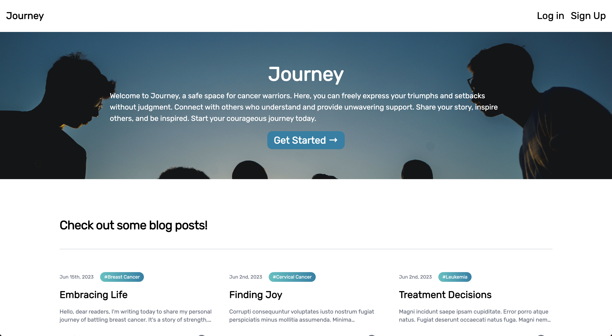

# Journey - A MERN Cancer Blog Application

## Description

Welcome to Journey, a MERN-based (MongoDB, Express.js, React.js, Node.js) cancer blog application that aims to provide a platform for individuals battling cancer to share their personal experiences, seek support, and inspire others along their journey. As a cancer survivor, I wanted to create a side passion project that hits close to home while showcasing my coding skills!

Below is a preview of the deployed application:

## Table of Contents
 - [Installation](#installation)
 - [Features](#features)
 - [Usage](#usage)
 - [Credits](#credits)
 - [License](#license)
 - [Questions](#questions)
 
## Features
 - **User Registration and Authentication:** Create an account or log in to access personalized features and engage with the community.
 - **Create Inspiring Blog Posts:** Share your unique cancer journey through heartfelt blog posts to inspire and uplift others.
 - **Supportive Community:** Connect with a compassionate community, receive support, and engage in meaningful conversations through comments on blog posts.
 
## Installation
 
 To install you can clone this repository and run command "npm i" in the command line to install all dependencies. You can also simply navigate to the link of the deployed application (link below).
 
## Usage
 
 You can find the deployed applicaion [here]().

## Credits

 Below are the various packages used to create the application and other credits.

 - [Express Documentation](https://expressjs.com/)
 - [React Documentation](https://react.dev/)
 - [Tailwind CSS Documentation](https://tailwindcss.com/docs/installation)
 - [Node.js Documentation](https://nodejs.org/en/docs/)
 - [Concurrently Documentation](https://www.npmjs.com/package/concurrently)
 - [Apollo-server-express Documentation](https://www.npmjs.com/package/@apollo/server)
 - [Apollo client Documentation](https://www.npmjs.com/package/@apollo/client)
 - [Bcrypt Documention](https://www.npmjs.com/package/bcrypt)
 - [dotenv Documention](https://www.npmjs.com/package/dotenv)
 - [Graphql Documention](https://graphql.org/code/#javascript)
 - [Jsonwebstoken Documention](https://www.npmjs.com/package/jsonwebtoken)
 - [Mongoose Documentation](https://mongoosejs.com/docs/documents.html)
 - [Fakerjs Documentation](https://fakerjs.dev/guide/)
 - [Nodemon Documentation]()
 - [Framer motion Documentation](https://www.framer.com/motion/)
 - [Jwt-decode Documentation](https://www.npmjs.com/package/jwt-decode)
 - [React-icons Documentation](https://react-icons.github.io/react-icons)
 - [React router dom Documentation](https://www.npmjs.com/package/react-router-dom)
 - [React tooltip Documentation](https://react-tooltip.com/docs/getting-started)
 - Background Image by [Papaioannou Kostas](https://unsplash.com/fr/@papaioannou_kostas?utm_source=unsplash&utm_medium=referral&utm_content=creditCopyText) on [Unsplash](https://unsplash.com/photos/tysecUm5HJA?utm_source=unsplash&utm_medium=referral&utm_content=creditCopyText)

 

 
## License
 
 This project is licensed under MIT
 
 Permission is hereby granted, free of charge, to any person obtaining a copy of this software and associated documentation files (the "Software"), to deal in the Software without restriction, including without limitation the rights to use, copy, modify, merge, publish, distribute, sublicense, and/or sell copies of the Software, and to permit persons to whom the Software is furnished to do so, subject to the following conditions:
 
 The above copyright notice and this permission notice shall be included in all copies or substantial portions of the Software.
 
 THE SOFTWARE IS PROVIDED "AS IS", WITHOUT WARRANTY OF ANY KIND, EXPRESS OR IMPLIED, INCLUDING BUT NOT LIMITED TO THE WARRANTIES OF MERCHANTABILITY, FITNESS FOR A PARTICULAR PURPOSE AND NONINFRINGEMENT. IN NO EVENT SHALL THE AUTHORS OR COPYRIGHT HOLDERS BE LIABLE FOR ANY CLAIM, DAMAGES OR OTHER LIABILITY, WHETHER IN AN ACTION OF CONTRACT, TORT OR OTHERWISE, ARISING FROM, OUT OF OR IN CONNECTION WITH THE SOFTWARE OR THE USE OR OTHER DEALINGS IN THE SOFTWARE.
 
## Questions
 
 If you have any further questions please feel free to reach out to me via email [here](mailto:christopher.sarm15@gmail.com).
 
 To view more of our work please visit my GitHub page [here](https://github.com/chris-15)
